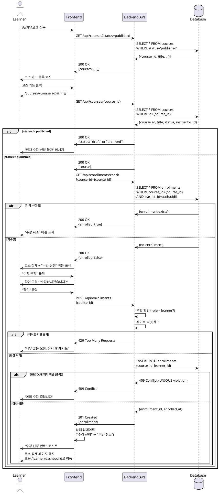

# 004. 코스 수강신청 (Learner)

## Primary Actor
Learner (학습자)

## Precondition
- 사용자가 Learner 역할로 로그인된 상태
- 온보딩 완료 (`onboarded = true`, `role = 'learner'`)
- 수강 신청하려는 코스가 `published` 상태

## Trigger
Learner가 코스 상세 페이지에서 "수강 신청" 버튼 클릭

## Main Scenario

1. Learner가 홈/카탈로그에서 코스 탐색
2. 관심 있는 코스 카드 클릭
3. `/courses/{course_id}` 상세 페이지로 이동
4. 시스템이 수강 신청 가능 여부 확인
   - 코스 상태가 `published`인지 확인
   - 이미 수강 중인지 확인 (`enrollments` 테이블 조회)
   - 본인이 만든 코스인지 확인 (Instructor는 자기 코스 신청 불가)
5. "수강 신청" 버튼 표시 (조건 충족 시)
6. Learner가 "수강 신청" 버튼 클릭
7. 확인 모달 표시 (선택): "이 코스를 수강하시겠습니까?"
8. Learner가 "확인" 클릭
9. 시스템이 `enrollments` 테이블에 레코드 생성
   - `course_id = {course_id}`
   - `learner_id = auth.uid()`
   - `enrolled_at = NOW()`
10. 성공 후 페이지 새로고침 또는 상태 업데이트
11. "수강 신청" 버튼이 "수강 취소" 버튼으로 변경
12. "수강 신청이 완료되었습니다" 토스트 메시지 표시
13. Learner 대시보드의 "내 코스" 목록에 자동 추가

## Edge Cases

### 1. 권한 없음 (Instructor 접근)
- **상황**: Instructor 역할 사용자가 수강 신청 시도
- **처리**:
  - "수강 신청" 버튼 숨김 (UI 레벨)
  - API 요청 시 HTTP 403 Forbidden 반환
  - "강사는 코스를 수강할 수 없습니다" 메시지

### 2. 이미 수강 중
- **상황**: 동일한 코스를 중복 수강 신청 시도
- **처리**:
  - "수강 신청" 버튼 비활성화 (이미 "수강 취소" 버튼으로 변경됨)
  - API 요청 시 HTTP 409 Conflict 반환
  - "이미 수강 중인 코스입니다" 메시지

### 3. 코스가 Draft 상태
- **상황**: `status = 'draft'` 코스에 수강 신청 시도
- **처리**:
  - 카탈로그에 노출되지 않음 (SELECT WHERE status='published')
  - URL 직접 접근 시 "수강 신청" 버튼 숨김
  - "현재 수강 신청이 불가능한 코스입니다" 메시지
  - Instructor 본인만 조회 가능

### 4. 코스가 Archived 상태
- **상황**: `status = 'archived'` 코스에 수강 신청 시도
- **처리**:
  - "수강 신청" 버튼 대신 "보관된 코스" 배지 표시
  - "이 코스는 더 이상 수강 신청을 받지 않습니다" 메시지
  - 기존 수강생은 계속 접근 가능 (Archived ≠ Deleted)

### 5. 본인이 만든 코스
- **상황**: Instructor가 자기가 만든 코스에 수강 신청 시도 (역할 전환 가능한 경우)
- **처리**:
  - "수강 신청" 버튼 숨김
  - "본인이 생성한 코스입니다" 메시지
  - "코스 관리" 버튼 표시 (Instructor 권한)

### 6. 코스 삭제됨
- **상황**: 수강 신청 중 코스가 삭제된 경우
- **처리**:
  - HTTP 404 Not Found 반환
  - "코스를 찾을 수 없습니다" 메시지
  - 카탈로그로 리다이렉트

### 7. 네트워크 오류
- **상황**: 수강 신청 요청 중 네트워크 단절
- **처리**:
  - "네트워크 연결이 끊어졌습니다" 메시지
  - "재시도" 버튼 제공
  - 중복 신청 방지 (idempotent 처리)

### 8. 데이터베이스 오류
- **상황**: `enrollments` INSERT 실패
- **처리**:
  - HTTP 500 Internal Server Error 반환
  - "수강 신청에 실패했습니다. 잠시 후 다시 시도해주세요" 메시지
  - 에러 로그 기록
  - "재시도" 버튼 제공

### 9. 정원 초과 (선택)
- **상황**: 코스 최대 수강 인원 도달
- **처리**:
  - "수강 신청" 버튼 비활성화
  - "정원이 마감되었습니다" 메시지
  - "대기자 신청" 버튼 제공 (Phase 2)

### 10. 동시성 문제
- **상황**: 동일 사용자가 여러 탭/창에서 동시에 수강 신청
- **처리**:
  - Database UNIQUE 제약 (`course_id, learner_id`)으로 중복 방지
  - 두 번째 요청은 HTTP 409 Conflict 반환
  - "이미 수강 신청이 처리되었습니다" 메시지

### 11. 레이트 리밋 초과
- **상황**: 1분 내 20개 이상 코스 수강 신청 시도
- **처리**:
  - HTTP 429 Too Many Requests 반환
  - "너무 많은 요청입니다. 잠시 후 다시 시도해주세요" 메시지
  - 봇/스팸 방지 목적

### 12. 미인증 사용자
- **상황**: 로그인하지 않은 사용자가 수강 신청 시도
- **처리**:
  - "수강 신청" 버튼 대신 "로그인" 버튼 표시
  - 버튼 클릭 시 로그인 페이지로 리다이렉트
  - 로그인 후 현재 페이지로 돌아옴 (return_url 파라미터)

## Business Rules

### BR-004-01: Learner 전용
- 수강 신청은 `role = 'learner'`인 사용자만 가능
- Instructor는 자기 코스 수강 불가
- Guest는 로그인 필요

### BR-004-02: Published 코스만 신청 가능
- `status = 'published'` 코스만 카탈로그 노출
- `draft`: Instructor 본인만 조회
- `archived`: 신규 신청 불가, 기존 수강생은 접근 가능

### BR-004-03: 중복 신청 불가
- `(course_id, learner_id)` UNIQUE 제약
- 이미 수강 중인 코스는 재신청 불가
- 수강 취소 후 재신청 가능

### BR-004-04: 즉시 활성화
- 수강 신청 즉시 코스 자료 접근 가능
- 별도 승인 절차 없음 (MVP)
- Phase 2에서 승인 시스템 추가 가능

### BR-004-05: 자동 타임스탬프
- `enrolled_at`: 수강 신청 시각 자동 기록

### BR-004-06: 수강 취소 가능
- Learner는 언제든지 수강 취소 가능 (MVP)
- 취소 시 `enrollments` 레코드 삭제 (하드 삭제)
- Phase 2: 소프트 삭제로 변경 (이력 관리)

### BR-004-07: 레이트 리밋
- 동일 Learner가 1분 내 20개 이상 수강 신청 시 차단
- 정상적인 사용 패턴 고려 (봇만 차단)

### BR-004-08: 정원 제한 (선택, Phase 2)
- 코스별 최대 수강 인원 설정 가능
- 정원 도달 시 수강 신청 불가
- 대기자 명단 기능

### BR-004-09: RLS 정책
- Learner는 본인의 `enrollments` 레코드만 생성 가능
- `learner_id = auth.uid()` 조건
- Instructor는 본인 코스의 수강생 목록 조회 가능

### BR-004-10: 무료 수강
- MVP에서는 모든 코스 무료
- Phase 3에서 유료 코스 결제 시스템 추가

---

## Sequence Diagram
