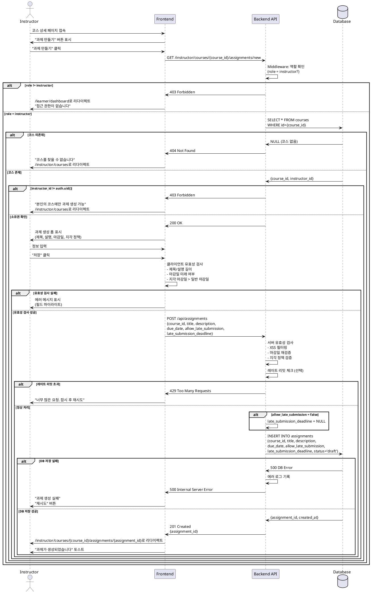

# 005. 과제 생성 (Instructor)

## Primary Actor
Instructor (강사)

## Precondition
- 사용자가 Instructor 역할로 로그인된 상태
- 온보딩 완료 (`onboarded = true`, `role = 'instructor'`)
- 본인이 생성한 코스가 최소 1개 이상 존재

## Trigger
Instructor가 코스 상세 페이지 또는 과제 관리 페이지에서 "과제 만들기" 버튼 클릭

## Main Scenario

1. Instructor가 `/instructor/courses/{course_id}/assignments/new` 페이지 접속
2. Middleware가 역할 및 코스 소유권 확인
   - `role = 'instructor'`
   - `course.instructor_id = auth.uid()`
3. 과제 생성 폼 표시
   - 제목 (필수)
   - 설명 (필수)
   - 마감일 (날짜 + 시간, 필수)
   - 지각 제출 허용 여부 (체크박스, 선택)
   - 지각 마감일 (날짜 + 시간, 지각 허용 시 필수)
4. Instructor가 정보 입력
5. "저장" 버튼 클릭
6. 시스템이 클라이언트 유효성 검사 수행
   - 제목 길이 검증 (1-200자)
   - 설명 길이 검증 (10-5000자)
   - 마감일이 미래인지 확인
   - 지각 제출 허용 시 지각 마감일 필수 체크
   - 지각 마감일 > 일반 마감일 확인
7. 시스템이 `assignments` 테이블에 레코드 생성
   - `course_id = {course_id}`
   - `status = 'draft'`
   - `allow_late_submission = 체크박스 값`
   - `late_submission_deadline = 지각 허용 시에만 저장`
8. 생성 성공 후 `/instructor/courses/{course_id}/assignments/{assignment_id}` 상세 페이지로 리다이렉트
9. "과제가 생성되었습니다" 성공 메시지 표시

## Edge Cases

### 1. 권한 없음 (Learner 접근)
- **상황**: Learner 역할 사용자가 과제 생성 페이지 접근 시도
- **처리**:
  - Middleware에서 차단
  - HTTP 403 Forbidden 반환
  - `/learner/dashboard`로 강제 리다이렉트
  - "접근 권한이 없습니다" 메시지

### 2. 코스 소유권 없음
- **상황**: 다른 Instructor의 코스에 과제 생성 시도
- **처리**:
  - HTTP 403 Forbidden 반환
  - "본인의 코스에만 과제를 생성할 수 있습니다" 메시지
  - `/instructor/courses`로 리다이렉트

### 3. 코스가 존재하지 않음
- **상황**: 삭제되었거나 존재하지 않는 `course_id`로 접근
- **처리**:
  - HTTP 404 Not Found 반환
  - "코스를 찾을 수 없습니다" 메시지
  - `/instructor/courses`로 리다이렉트

### 4. 제목 길이 초과
- **상황**: 201자 이상의 제목 입력
- **처리**:
  - 클라이언트에서 실시간 검증
  - 입력 제한 (maxLength=200)
  - "제목은 200자 이내로 입력해주세요" 메시지
  - 현재 글자 수 / 200 카운터 표시

### 5. 설명 미입력 또는 너무 짧음
- **상황**: 설명 필드를 비우거나 10자 미만 입력
- **처리**:
  - "설명은 최소 10자 이상 입력해주세요" 에러 메시지
  - 설명 필드 하이라이트
  - 현재 글자 수 표시
  - 제출 버튼 비활성화

### 6. 마감일이 과거
- **상황**: 현재 시각보다 이전의 마감일 선택
- **처리**:
  - "마감일은 현재 시각 이후여야 합니다" 에러 메시지
  - 마감일 필드 하이라이트
  - 제출 버튼 비활성화
  - 최소 선택 가능 시간: 현재 + 1시간 (권장)

### 7. 지각 마감일이 일반 마감일보다 이름
- **상황**: `late_submission_deadline <= due_date` 조건 위반
- **처리**:
  - "지각 마감일은 일반 마감일 이후여야 합니다" 에러 메시지
  - 지각 마감일 필드 하이라이트
  - 제출 버튼 비활성화
  - 권장 값 자동 설정 (일반 마감일 + 7일)

### 8. 지각 허용 체크했으나 지각 마감일 미입력
- **상황**: `allow_late_submission = true`, `late_submission_deadline = null`
- **처리**:
  - "지각 제출을 허용하려면 지각 마감일을 입력해주세요" 에러 메시지
  - 지각 마감일 필드 하이라이트 및 활성화
  - 제출 버튼 비활성화

### 9. 지각 미허용인데 지각 마감일 입력됨
- **상황**: `allow_late_submission = false`, `late_submission_deadline != null`
- **처리**:
  - 클라이언트: 지각 마감일 필드 비활성화 (입력 불가)
  - 서버: 지각 마감일 값 무시 (`late_submission_deadline = NULL` 저장)
  - 에러 아님, 자동 처리

### 10. 데이터베이스 저장 실패
- **상황**: `assignments` 테이블 INSERT 실패
- **처리**:
  - HTTP 500 Internal Server Error 반환
  - "과제 생성에 실패했습니다. 잠시 후 다시 시도해주세요" 메시지
  - 에러 로그 기록 (모니터링)
  - "재시도" 버튼 제공
  - 입력한 내용 유지 (재입력 방지)

### 11. 네트워크 단절
- **상황**: 저장 요청 중 네트워크 연결 끊김
- **처리**:
  - "네트워크 연결이 끊어졌습니다" 메시지
  - "재시도" 버튼 제공
  - 로컬 스토리지에 입력 내용 임시 저장 (선택)
  - 재접속 시 복구 가능

### 12. 마감일 형식 오류
- **상황**: 유효하지 않은 날짜 형식 입력
- **처리**:
  - 날짜 선택기 (DatePicker) 사용으로 원천 차단
  - 직접 입력 허용 시: "유효한 날짜를 입력해주세요" 메시지
  - ISO 8601 형식으로 변환 실패 시 에러

### 13. XSS 공격 시도
- **상황**: 제목/설명에 `<script>` 태그 등 악의적 코드 입력
- **처리**:
  - 서버에서 입력값 Sanitize
  - 위험한 태그 제거 또는 이스케이프 처리
  - 안전한 HTML만 허용 (마크다운 지원 시)

### 14. 과제 생성 한도 초과 (선택)
- **상황**: 코스당 최대 과제 수 제한 (예: 무료 티어 50개)
- **처리**:
  - "이 코스는 최대 50개까지 과제를 생성할 수 있습니다" 메시지
  - 기존 과제 삭제 또는 업그레이드 안내

## Business Rules

### BR-005-01: Instructor 전용
- 과제 생성은 `role = 'instructor'`인 사용자만 가능
- Middleware 및 API에서 이중 검증

### BR-005-02: 코스 소유권 필수
- 본인이 생성한 코스 (`course.instructor_id = auth.uid()`)에만 과제 생성 가능
- RLS 정책으로 강제

### BR-005-03: 초기 상태는 Draft
- 새로 생성된 과제의 기본 상태는 `draft`
- `draft` 상태 과제는 Learner에게 보이지 않음
- Instructor가 명시적으로 `published`로 전환 필요

### BR-005-04: 필수 입력 항목
- 제목: 1-200자 (필수)
- 설명: 10-5000자 (필수)
- 마감일: 미래 시각 (필수)
- 지각 허용 시: 지각 마감일 필수

### BR-005-05: 마감일 검증 규칙
- 일반 마감일 > 현재 시각
- 지각 허용 시: 지각 마감일 > 일반 마감일
- 권장: 일반 마감일은 생성 시각 + 최소 1시간 이후

### BR-005-06: 지각 제출 정책
- `allow_late_submission = false` (기본값)
- `allow_late_submission = true` 시:
  - `late_submission_deadline` 필수
  - `late_submission_deadline > due_date`

### BR-005-07: 과제-코스 관계
- 과제는 반드시 하나의 코스에 속함 (FK)
- 코스 삭제 시 과제도 Cascade 삭제 (또는 소프트 삭제)

### BR-005-08: 자동 타임스탬프
- `created_at`: 생성 시각 자동 기록
- `updated_at`: 수정 시각 자동 갱신 (DB trigger)

### BR-005-09: 레이트 리밋 (선택)
- 동일 Instructor가 1분 내 10개 이상 과제 생성 시 차단
- 봇/스팸 방지 목적

### BR-005-10: 과제 순서 (선택, Phase 2)
- 과제 순서 필드 (`order` INTEGER)
- 드래그앤드롭으로 순서 변경 가능

### BR-005-11: 점수 배점 (선택, Phase 2)
- 과제별 배점 설정 (`max_score` INTEGER)
- 코스 총점 계산 시 활용

### BR-005-12: 파일 첨부 (선택, Phase 2)
- Instructor가 과제 설명에 파일 첨부 가능
- 예: 과제 템플릿, 참고 자료

---

## Sequence Diagram

