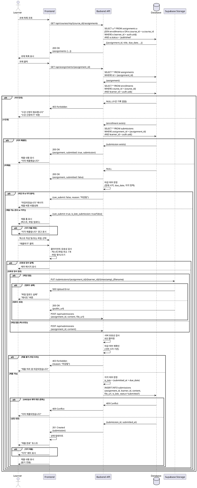

# 006. 과제 제출 (Learner)

## Primary Actor
Learner (학습자)

## Precondition
- 사용자가 Learner 역할로 로그인된 상태
- 온보딩 완료 (`onboarded = true`, `role = 'learner'`)
- 해당 코스를 수강 신청한 상태 (`enrollments` 레코드 존재)
- 과제 상태가 `published`
- 아직 제출하지 않은 과제 (또는 재제출 요청된 과제)

## Trigger
Learner가 과제 상세 페이지에서 "제출하기" 버튼 클릭

## Main Scenario

1. Learner가 대시보드 또는 코스 페이지에서 과제 목록 조회
2. 제출할 과제 클릭 → `/courses/my/{course_id}/assignments/{assignment_id}` 이동
3. 시스템이 제출 가능 여부 확인
   - 수강 신청 여부 확인
   - 과제 상태가 `published`인지 확인
   - 이미 제출했는지 확인 (`submissions` 테이블)
   - 마감 시간 확인 (정시/지각/불가 판정)
4. 제출 폼 표시
   - 텍스트 입력 (선택, 최대 10,000자)
   - 파일 업로드 (선택, 최대 10MB)
   - 현재 시각, 마감일, 남은 시간 표시
   - 지각 제출 정책 안내 (허용 시)
5. Learner가 텍스트 작성 및/또는 파일 선택
6. "제출하기" 버튼 클릭
7. 시스템이 클라이언트 유효성 검사 수행
   - 텍스트 또는 파일 중 최소 1개 입력 확인
   - 텍스트 길이 검증 (최대 10,000자)
   - 파일 형식 검증 (허용: PDF, DOC, DOCX, ZIP, JPG, PNG)
   - 파일 크기 검증 (최대 10MB)
8. 파일이 있는 경우 Supabase Storage에 업로드
   - 저장 경로: `submissions/{assignment_id}/{learner_id}/{timestamp}_{filename}`
   - 공개 URL 생성
9. 시스템이 제출 가능 여부 재확인 (서버 시각 기준)
10. 지각 여부 판정
    - `submitted_at <= due_date` → `is_late = false` (정시)
    - `submitted_at > due_date AND allow_late_submission = true AND submitted_at <= late_submission_deadline` → `is_late = true` (지각)
    - 그 외 → 제출 불가
11. 시스템이 `submissions` 테이블에 레코드 생성
    - `assignment_id`, `learner_id`, `content`, `file_url`, `is_late`, `status = 'submitted'`
12. 성공 후 과제 상세 페이지 새로고침
13. "제출이 완료되었습니다" 토스트 메시지 표시
14. "제출하기" 버튼이 "제출 완료" 배지로 변경
15. 제출 내용 표시 (텍스트, 파일 다운로드 링크)

## Edge Cases

### 1. 권한 없음 (Instructor 접근)
- **상황**: Instructor 역할 사용자가 과제 제출 시도
- **처리**:
  - "제출하기" 버튼 숨김 (UI 레벨)
  - API 요청 시 HTTP 403 Forbidden 반환
  - "강사는 과제를 제출할 수 없습니다" 메시지

### 2. 미수강생 접근
- **상황**: 코스를 수강 신청하지 않은 Learner가 과제 제출 시도
- **처리**:
  - HTTP 403 Forbidden 반환
  - "수강 신청이 필요합니다" 메시지
  - "수강 신청하기" 버튼 제공
  - 코스 상세 페이지로 리다이렉트

### 3. 과제가 Draft 상태
- **상황**: `status = 'draft'` 과제에 제출 시도
- **처리**:
  - 과제 목록에 노출되지 않음
  - URL 직접 접근 시 HTTP 404 Not Found 반환
  - "과제를 찾을 수 없습니다" 메시지

### 4. 과제가 Closed 상태
- **상황**: `status = 'closed'` 과제에 제출 시도
- **처리**:
  - "제출하기" 버튼 비활성화
  - "마감된 과제입니다" 메시지
  - 이미 제출한 경우 제출 내용 조회만 가능

### 5. 이미 제출함
- **상황**: 동일 과제에 중복 제출 시도
- **처리**:
  - "제출하기" 버튼 숨김
  - "이미 제출한 과제입니다" 메시지
  - 제출 내용 표시 (읽기 전용)
  - "수정" 버튼 없음 (재제출 요청 시에만 가능)

### 6. 마감 후 제출 (지각 불허)
- **상황**: `submitted_at > due_date AND allow_late_submission = false`
- **처리**:
  - "제출하기" 버튼 비활성화
  - "마감 시간이 지났습니다. 지각 제출이 허용되지 않습니다" 메시지
  - Instructor에게 문의 안내

### 7. 지각 마감일 초과
- **상황**: `submitted_at > late_submission_deadline`
- **처리**:
  - "제출하기" 버튼 비활성화
  - "지각 제출 마감 시간도 지났습니다" 메시지
  - 제출 불가

### 8. 지각 제출 (정상)
- **상황**: `due_date < submitted_at <= late_submission_deadline AND allow_late_submission = true`
- **처리**:
  - 제출 가능
  - "지각 제출됩니다" 경고 메시지 표시
  - 확인 모달: "지각 제출로 기록됩니다. 계속하시겠습니까?"
  - 제출 후 "지각" 배지 표시

### 9. 텍스트/파일 둘 다 없음
- **상황**: 빈 폼으로 제출 시도
- **처리**:
  - "텍스트 또는 파일 중 최소 하나를 입력해주세요" 에러 메시지
  - 제출 버튼 비활성화

### 10. 텍스트 길이 초과
- **상황**: 10,001자 이상 텍스트 입력
- **처리**:
  - 클라이언트에서 실시간 검증
  - 입력 제한 (maxLength=10000)
  - "텍스트는 10,000자 이내로 입력해주세요" 메시지
  - 현재 글자 수 / 10,000 카운터 표시

### 11. 파일 형식 오류
- **상황**: 지원하지 않는 파일 형식 (예: .exe, .sh)
- **처리**:
  - "지원하지 않는 파일 형식입니다" 에러 메시지
  - 지원 형식 안내: "PDF, DOC, DOCX, ZIP, JPG, PNG만 가능합니다"
  - 파일 선택 초기화

### 12. 파일 크기 초과
- **상황**: 10MB 초과 파일 업로드 시도
- **처리**:
  - "파일 크기는 10MB 이하여야 합니다" 에러 메시지
  - 현재 파일 크기 표시 (예: "현재: 15.2MB")
  - 파일 선택 초기화
  - 파일 압축 안내

### 13. 파일 업로드 실패
- **상황**: Supabase Storage 업로드 중 네트워크 오류
- **처리**:
  - "파일 업로드에 실패했습니다" 에러 메시지
  - "재시도" 버튼 제공
  - 입력한 텍스트 유지 (재입력 방지)
  - 또는 "파일 없이 제출" 옵션 제공

### 14. 데이터베이스 저장 실패
- **상황**: `submissions` 테이블 INSERT 실패
- **처리**:
  - HTTP 500 Internal Server Error 반환
  - "제출에 실패했습니다. 잠시 후 다시 시도해주세요" 메시지
  - 에러 로그 기록
  - 이미 업로드된 파일 삭제 (정리)
  - "재시도" 버튼 제공

### 15. 네트워크 단절
- **상황**: 제출 요청 중 네트워크 연결 끊김
- **처리**:
  - "네트워크 연결이 끊어졌습니다" 메시지
  - "재시도" 버튼 제공
  - 로컬 스토리지에 텍스트 임시 저장
  - 재접속 시 복구 가능

### 16. 동시성 문제
- **상황**: 여러 탭/창에서 동시에 제출 시도
- **처리**:
  - Database UNIQUE 제약 (`assignment_id, learner_id`)으로 중복 방지
  - 두 번째 요청은 HTTP 409 Conflict 반환
  - "이미 제출이 처리되었습니다" 메시지

### 17. 제출 중 마감 시간 도래
- **상황**: 제출 버튼 클릭 → 파일 업로드 중 → 마감 시간 경과
- **처리**:
  - 서버 시각 기준으로 최종 판정
  - 업로드 완료 시각이 마감 이후면 지각 또는 불가 처리
  - "제출 처리 중 마감 시간이 지났습니다" 메시지
  - 지각 허용 시 지각 제출로 처리

### 18. 악성 파일 업로드
- **상황**: 바이러스, 멀웨어 포함 파일 업로드 시도
- **처리**:
  - 파일 스캔 (선택, Phase 2)
  - 의심 파일 차단
  - "안전하지 않은 파일이 감지되었습니다" 메시지
  - 관리자 알림

### 19. XSS 공격 시도
- **상황**: 텍스트에 `<script>` 태그 등 악의적 코드 입력
- **처리**:
  - 서버에서 입력값 Sanitize
  - 위험한 태그 제거 또는 이스케이프 처리
  - 안전한 HTML만 허용

## Business Rules

### BR-006-01: Learner 전용
- 과제 제출은 `role = 'learner'`인 사용자만 가능
- Instructor는 자기 코스 과제도 제출 불가

### BR-006-02: 수강 신청 필수
- 코스를 수강 신청한 Learner만 과제 제출 가능
- `enrollments` 테이블에 레코드 존재 확인

### BR-006-03: Published 과제만 제출 가능
- `status = 'published'` 과제만 제출 가능
- `draft`, `closed` 과제는 제출 불가

### BR-006-04: 지각 제출 판정 로직
```typescript
function canSubmit(assignment: Assignment, submittedAt: Date) {
  const { due_date, allow_late_submission, late_submission_deadline } = assignment;
  
  // 정시 제출
  if (submittedAt <= due_date) {
    return { allowed: true, is_late: false };
  }
  
  // 지각 제출 허용 여부 확인
  if (!allow_late_submission) {
    return { allowed: false, reason: '마감 후 제출 불가' };
  }
  
  // 지각 마감일 확인
  if (submittedAt <= late_submission_deadline) {
    return { allowed: true, is_late: true };
  }
  
  // 지각 마감일 초과
  return { allowed: false, reason: '지각 마감일 초과' };
}
```

### BR-006-05: 제출 내용 요구사항

- 텍스트 또는 파일 중 최소 1개 필수
- 텍스트: 최대 10,000자
- 파일: 최대 10MB
- 지원 형식: PDF, DOC, DOCX, ZIP, JPG, PNG

### BR-006-06: 중복 제출 불가

- (`assignment_id`,` learner_id`) UNIQUE 제약
- 이미 제출한 과제는 재제출 불가 (재제출 요청 제외)

### BR-006-07: 파일 저장 경로

 submissions/{assignment_id}/{learner_id}/{timestamp}_{filename}
공개 접근 가능 (RLS: Instructor와 본인만 조회)

### BR-006-08: 제출 시각 기록

`submitted_at`: 서버 시각 기준 자동 기록
클라이언트 시각 신뢰 불가 (조작 가능)

### BR-006-09: 초기 상태

제출 직후 상태는 `submitted`
채점 후 `graded`로 변경
재제출 요청 시 `resubmit_requested`로 변경

### BR-006-10: 제출 후 수정 불가

제출한 내용은 수정 불가 (MVP)
Instructor가 재제출 요청한 경우에만 재제출 가능

### BR-006-11: 타임존

모든 시각은 UTC로 저장
클라이언트에서 사용자 타임존으로 변환 표시

### BR-006-12: 레이트 리밋 (선택)

동일 Learner가 1분 내 10회 이상 제출 시도 시 차단
정상적인 재시도는 허용

### BR-006-13: 제출 알림 (Phase 2)

제출 시 Instructor에게 이메일 알림
실시간 알림 (WebSocket)

## Sequence Diagram

