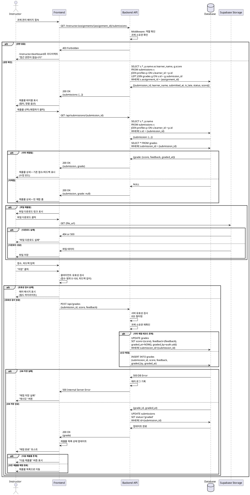

# 007. 제출물 채점 (Instructor)

## Primary Actor
Instructor (강사)

## Precondition
- 사용자가 Instructor 역할로 로그인된 상태
- 온보딩 완료 (`onboarded = true`, `role = 'instructor'`)
- 본인이 생성한 코스의 과제에 제출물이 존재
- 제출물 상태가 `submitted` 또는 `resubmit_requested` 이후 재제출됨

## Trigger
Instructor가 제출물 목록에서 특정 제출물의 "채점하기" 버튼 클릭

## Main Scenario

1. Instructor가 `/instructor/assignments/{assignment_id}/submissions` 페이지 접속
2. 시스템이 제출물 목록 조회
   - 과제 정보 표시 (제목, 마감일, 총 제출 수)
   - 제출물 테이블 (학생 이름, 제출 시간, 지각 여부, 상태, 점수)
   - 필터 옵션 (전체/미채점/채점완료/재제출요청/지각)
   - 정렬 옵션 (제출 시간 순, 이름 순)
3. Instructor가 채점할 제출물 선택
4. 제출물 상세 모달 또는 페이지 표시
   - 학생 이름
   - 제출 시간, 지각 여부
   - 제출 내용 (텍스트)
   - 파일 다운로드 링크
   - 채점 폼 (점수, 피드백)
5. Instructor가 점수 입력 (0-100)
6. Instructor가 피드백 작성 (선택, 최대 5000자)
7. "저장" 버튼 클릭
8. 시스템이 클라이언트 유효성 검사 수행
   - 점수 범위 검증 (0-100)
   - 피드백 길이 검증 (최대 5000자)
9. 시스템이 `grades` 테이블에 레코드 생성 또는 업데이트
   - `submission_id`, `score`, `feedback`, `graded_by = auth.uid()`, `graded_at = NOW()`
10. `submissions` 테이블 상태 업데이트 (`status = 'graded'`)
11. 성공 후 제출물 목록으로 돌아가거나 다음 제출물로 이동
12. "채점이 완료되었습니다" 토스트 메시지 표시
13. 제출물 테이블에서 점수 표시 및 상태 변경

## Edge Cases

### 1. 권한 없음 (Learner 접근)
- **상황**: Learner 역할 사용자가 제출물 채점 페이지 접근 시도
- **처리**:
  - Middleware에서 차단
  - HTTP 403 Forbidden 반환
  - `/learner/dashboard`로 강제 리다이렉트
  - "접근 권한이 없습니다" 메시지

### 2. 과제 소유권 없음
- **상황**: 다른 Instructor의 과제 제출물 채점 시도
- **처리**:
  - HTTP 403 Forbidden 반환
  - "본인의 과제에만 채점할 수 있습니다" 메시지
  - `/instructor/dashboard`로 리다이렉트

### 3. 제출물 미존재
- **상황**: 존재하지 않는 `submission_id`로 접근
- **처리**:
  - HTTP 404 Not Found 반환
  - "제출물을 찾을 수 없습니다" 메시지
  - 제출물 목록으로 리다이렉트

### 4. 점수 범위 초과
- **상황**: 음수 또는 100 초과 점수 입력
- **처리**:
  - 클라이언트에서 실시간 검증
  - 입력 제한 (min=0, max=100, type="number")
  - "점수는 0~100 사이로 입력해주세요" 에러 메시지
  - 제출 버튼 비활성화

### 5. 점수 미입력
- **상황**: 점수 필드를 비우고 저장 시도
- **처리**:
  - "점수는 필수 항목입니다" 에러 메시지
  - 점수 필드 하이라이트
  - 제출 버튼 비활성화

### 6. 피드백 길이 초과
- **상황**: 5001자 이상 피드백 입력
- **처리**:
  - 클라이언트에서 실시간 검증
  - 입력 제한 (maxLength=5000)
  - "피드백은 5000자 이내로 입력해주세요" 메시지
  - 현재 글자 수 / 5000 카운터 표시

### 7. 이미 채점됨 (재채점)
- **상황**: 이미 채점 완료된 제출물을 다시 채점
- **처리**:
  - 기존 점수/피드백 표시 (수정 모드)
  - "이미 채점된 제출물입니다. 수정하시겠습니까?" 안내
  - 저장 시 기존 `grades` 레코드 업데이트 (INSERT 아님)
  - `graded_at` 갱신

### 8. 데이터베이스 저장 실패
- **상황**: `grades` 테이블 INSERT/UPDATE 실패
- **처리**:
  - HTTP 500 Internal Server Error 반환
  - "채점 저장에 실패했습니다. 잠시 후 다시 시도해주세요" 메시지
  - 에러 로그 기록
  - "재시도" 버튼 제공
  - 입력한 점수/피드백 유지

### 9. 네트워크 단절
- **상황**: 채점 저장 중 네트워크 연결 끊김
- **처리**:
  - "네트워크 연결이 끊어졌습니다" 메시지
  - "재시도" 버튼 제공
  - 로컬 스토리지에 점수/피드백 임시 저장
  - 재접속 시 복구 가능

### 10. 동시 채점 충돌
- **상황**: 여러 Instructor가 동시에 동일 제출물 채점 (팀 티칭 가능한 경우)
- **처리**:
  - 낙관적 잠금 (Optimistic Locking) 적용 (선택)
  - 마지막 저장이 우선 (Last Write Wins)
  - "다른 Instructor가 이미 채점했습니다" 경고 (선택)

### 11. 재제출된 제출물
- **상황**: 재제출 요청 후 학생이 다시 제출한 제출물
- **처리**:
  - 이전 채점 기록 보존 (grades 테이블에 이력 유지, 선택)
  - 새 제출물에 새 채점 레코드 생성
  - 또는 기존 레코드 업데이트 (MVP)

### 12. 파일 다운로드 실패
- **상황**: 제출된 파일 다운로드 중 오류
- **처리**:
  - "파일을 다운로드할 수 없습니다" 메시지
  - 파일 URL 링크 제공 (직접 접근)
  - Supabase Storage 오류 로그 기록

### 13. XSS 공격 시도
- **상황**: 피드백에 `<script>` 태그 등 악의적 코드 입력
- **처리**:
  - 서버에서 입력값 Sanitize
  - 위험한 태그 제거 또는 이스케이프 처리
  - 안전한 HTML만 허용 (마크다운 지원 시)

### 14. 부분 점수 (소수점)
- **상황**: 소수점 점수 입력 (예: 95.5)
- **처리**:
  - 소수점 허용 (NUMERIC 타입)
  - 또는 정수만 허용 (step=1)
  - 정책에 따라 결정 (MVP: 정수만)

### 15. 일괄 채점 요청 (Phase 2)
- **상황**: 여러 제출물을 한 번에 동일 점수로 채점
- **처리**:
  - 체크박스로 다중 선택
  - "일괄 채점" 버튼
  - 점수 일괄 입력 모달

## Business Rules

### BR-007-01: Instructor 전용
- 채점은 `role = 'instructor'`인 사용자만 가능
- Learner는 본인 제출물도 채점 불가

### BR-007-02: 과제 소유권 필수
- 본인이 생성한 과제의 제출물만 채점 가능
- `assignment.course.instructor_id = auth.uid()`

### BR-007-03: 점수 범위
- 최소: 0
- 최대: 100
- 타입: 정수 (MVP) 또는 소수점 허용 (Phase 2)

### BR-007-04: 피드백
- 필수 아님 (선택)
- 최대 길이: 5000자
- 마크다운 지원 (선택, Phase 2)

### BR-007-05: 채점 상태 변경
- 채점 저장 시 `submissions.status = 'graded'`
- 이전 상태 무관하게 `graded`로 변경

### BR-007-06: 채점자 기록
- `grades.graded_by = auth.uid()`
- 채점한 Instructor ID 기록

### BR-007-07: 채점 시각 기록
- `grades.graded_at = NOW()`
- 서버 시각 기준 자동 기록

### BR-007-08: 재채점 가능
- 이미 채점된 제출물도 재채점 가능
- 기존 `grades` 레코드 업데이트
- `graded_at` 갱신 (마지막 채점 시각)

### BR-007-09: 제출물당 하나의 성적
- `grades.submission_id` UNIQUE 제약
- 하나의 제출물은 하나의 성적만 보유

### BR-007-10: 채점 이력 (선택, Phase 2)
- 재채점 시 이전 점수/피드백 보존
- `grades` 테이블에 버전 필드 추가
- 또는 별도 `grade_history` 테이블

### BR-007-11: 알림 (Phase 2)
- 채점 완료 시 Learner에게 이메일 알림
- 실시간 알림 (WebSocket)

### BR-007-12: 통계 자동 계산
- 과제별 평균 점수
- 코스별 평균 점수
- Learner별 성적 집계

### BR-007-13: 필터링 옵션
- 미채점만 보기
- 채점완료만 보기
- 지각 제출만 보기
- 재제출 요청한 것만 보기

---

## Sequence Diagram

