# 008. 재제출 요청 및 처리

## Primary Actor
- Instructor (재제출 요청)
- Learner (재제출 수행)

## Precondition

### Instructor (재제출 요청 시)
- Instructor 역할로 로그인된 상태
- 본인이 생성한 과제의 제출물이 존재
- 제출물 상태가 `submitted` 또는 `graded`

### Learner (재제출 시)
- Learner 역할로 로그인된 상태
- 본인이 제출한 과제의 상태가 `resubmit_requested`

## Trigger

### Instructor
채점 페이지에서 "재제출 요청" 체크박스 선택 후 저장

### Learner
대시보드 또는 과제 페이지에서 "재제출 요청됨" 알림 확인 후 과제 페이지 접속

## Main Scenario

### Part 1: Instructor가 재제출 요청

1. Instructor가 제출물 채점 페이지에서 제출물 검토
2. 제출물이 기준에 미달하거나 수정이 필요하다고 판단
3. 피드백 작성 (수정 요청 사항 명시)
4. "재제출 요청" 체크박스 선택
5. 점수 입력 (선택적, 또는 입력 불가로 설정)
6. "저장" 버튼 클릭
7. 시스템이 `submissions` 테이블 상태 업데이트
   - `status = 'resubmit_requested'`
8. 시스템이 `grades` 테이블 레코드 생성 또는 업데이트
   - `feedback` 저장 (재제출 사유 포함)
   - `score = NULL` (재제출 전까지 점수 보류)
9. Learner에게 알림 발송 (선택, Phase 2)
10. "재제출 요청이 전송되었습니다" 메시지 표시

### Part 2: Learner가 재제출 요청 확인

11. Learner가 대시보드 접속
12. "재제출 요청된 과제" 섹션에 과제 표시 (배지/알림)
13. Learner가 과제 클릭 → 과제 상세 페이지 이동
14. 시스템이 재제출 가능 상태 확인
    - `status = 'resubmit_requested'`
    - 과제 마감 정책 재확인 (재제출도 마감일 적용)
15. 페이지 상단에 "재제출 요청" 알림 배너 표시
    - Instructor 피드백 내용 표시
    - "재제출하기" 버튼
16. 기존 제출 내용 표시 (읽기 전용)
    - 이전 제출물 텍스트
    - 이전 제출 파일 다운로드 링크

### Part 3: Learner가 재제출

17. Learner가 "재제출하기" 버튼 클릭
18. 재제출 폼 표시
    - 새 텍스트 입력
    - 새 파일 업로드
    - 기존 제출 내용도 참고 가능
19. Learner가 수정된 내용 입력
20. "재제출" 버튼 클릭
21. 시스템이 유효성 검사 수행 (006과 동일)
22. 파일 업로드 (있는 경우)
    - 새 파일 경로: `submissions/{assignment_id}/{learner_id}/resubmit_{timestamp}_{filename}`
23. 재제출 방식 선택 (정책에 따름):
    - **방식 A (권장)**: 기존 `submissions` 레코드 업데이트
      - `content`, `file_url` 업데이트
      - `submitted_at` 갱신
      - `status = 'submitted'` (재채점 대기)
      - `resubmission_count` 증가
    - **방식 B**: 새 `submissions` 레코드 생성
      - 기존 레코드는 보관 (이력)
      - `parent_submission_id` FK로 연결
24. 기존 `grades` 레코드 삭제 또는 상태 변경
    - 삭제: 재채점 시 새로 생성
    - 상태 변경: `status = 'pending_regrade'`
25. "재제출이 완료되었습니다" 메시지 표시
26. Instructor에게 알림 발송 (선택)

## Edge Cases

### 1. 재제출 권한 없음
- **상황**: `status != 'resubmit_requested'`인 과제에 재제출 시도
- **처리**:
  - "재제출이 허용되지 않은 과제입니다" 메시지
  - "재제출하기" 버튼 비활성화
  - 읽기 전용 모드

### 2. 재제출도 마감 시간 적용
- **상황**: 재제출 시도 시각이 `due_date` 또는 `late_submission_deadline` 초과
- **처리**:
  - 006의 마감 로직과 동일하게 적용
  - "재제출도 마감 시간이 지났습니다" 메시지
  - 재제출 불가
  - Instructor에게 문의 안내

### 3. 재제출 횟수 제한 (선택)
- **상황**: `resubmission_count >= 3` (최대 3회)
- **처리**:
  - "최대 재제출 횟수를 초과했습니다" 메시지
  - 재제출 불가
  - Instructor에게 문의 안내

### 4. 재제출 중 Instructor가 재채점
- **상황**: Learner 재제출 중 Instructor가 동일 제출물 재채점
- **처리**:
  - 낙관적 잠금 (Optimistic Locking) 사용
  - "제출물이 다른 곳에서 수정되었습니다" 경고
  - 최신 상태 로드 후 재시도

### 5. 재제출 없이 텍스트/파일 둘 다 비움
- **상황**: 기존 제출 내용을 삭제하고 빈 폼 제출
- **처리**:
  - "텍스트 또는 파일 중 최소 하나를 입력해주세요" 에러 메시지
  - 제출 버튼 비활성화

### 6. 파일만 재제출 (텍스트 삭제)
- **상황**: 기존 텍스트를 삭제하고 파일만 업로드
- **처리**:
  - 허용 (파일만 있어도 유효)
  - `content = NULL`, `file_url` 업데이트

### 7. 텍스트만 재제출 (파일 삭제)
- **상황**: 기존 파일을 삭제하고 텍스트만 작성
- **처리**:
  - 허용 (텍스트만 있어도 유효)
  - `content` 업데이트, `file_url = NULL`
  - 기존 파일 삭제 (Storage 정리)

### 8. 재제출 파일 업로드 실패
- **상황**: Supabase Storage 업로드 실패
- **처리**:
  - "파일 업로드 실패" 메시지
  - "재시도" 버튼 제공
  - 입력한 텍스트 유지
  - 기존 제출물은 그대로 유지 (변경 없음)

### 9. 데이터베이스 업데이트 실패
- **상황**: `submissions` UPDATE 또는 INSERT 실패
- **처리**:
  - HTTP 500 Internal Server Error 반환
  - "재제출 저장 실패" 메시지
  - 에러 로그 기록
  - 이미 업로드된 파일 삭제 (정리)
  - "재시도" 버튼 제공

### 10. 재제출 후 즉시 또 재제출 요청
- **상황**: Learner 재제출 → Instructor 확인 → 즉시 재제출 요청
- **처리**:
  - 정상 동작 (재제출 횟수만 증가)
  - 무한 루프 방지: 최대 재제출 횟수 제한 (예: 3회)

### 11. 재제출 요청 취소 (Instructor)
- **상황**: Instructor가 재제출 요청을 실수로 보냄
- **처리**:
  - "재제출 요청 취소" 버튼 제공
  - `status = 'submitted'` 또는 `'graded'`로 복원
  - Learner에게 취소 알림 (선택)

### 12. 네트워크 단절
- **상황**: 재제출 요청/재제출 중 네트워크 연결 끊김
- **처리**:
  - "네트워크 연결 끊김" 메시지
  - "재시도" 버튼 제공
  - 로컬 스토리지에 임시 저장
  - 재접속 시 복구

### 13. 재제출 이력 조회
- **상황**: 여러 번 재제출한 과제의 이력 확인
- **처리**:
  - "제출 이력" 버튼 제공 (Phase 2)
  - 모달에서 모든 제출 버전 표시
  - 각 버전의 피드백, 점수 확인 가능

### 14. XSS 공격 시도
- **상황**: 재제출 텍스트에 악의적 코드 입력
- **처리**:
  - 006과 동일한 Sanitize 로직
  - 위험한 태그 제거

## Business Rules

### BR-008-01: 재제출 요청 권한
- Instructor만 재제출 요청 가능
- 본인이 생성한 과제의 제출물에만

### BR-008-02: 재제출 수행 권한
- Learner만 재제출 가능
- 본인이 제출한 과제가 `resubmit_requested` 상태일 때만

### BR-008-03: 재제출 시 마감 정책 적용
- 재제출도 일반 제출과 동일한 마감 로직 적용
- `due_date`, `allow_late_submission`, `late_submission_deadline` 모두 체크

### BR-008-04: 재제출 방식 (MVP)
- **방식 A (권장)**: 기존 `submissions` 레코드 업데이트
  - `content`, `file_url`, `submitted_at` 업데이트
  - `status = 'submitted'`
  - `resubmission_count` 증가
- 이력 관리는 Phase 2에서 구현

### BR-008-05: 재제출 횟수 제한 (선택)
- 최대 3회까지 재제출 허용
- `resubmission_count` 필드로 추적
- 초과 시 Instructor 문의 안내

### BR-008-06: 기존 점수 처리
- 재제출 요청 시: `grades.score = NULL` (보류)
- 재제출 완료 시: 기존 `grades` 레코드 삭제 또는 상태 변경
- 재채점 시: 새 `grades` 레코드 생성

### BR-008-07: 피드백 필수 (재제출 요청 시)
- 재제출 요청 시 피드백 필수 입력
- 최소 10자 이상 (수정 사유 명시)
- "재제출이 필요한 이유를 명확히 작성해주세요" 안내

### BR-008-08: 상태 전환 흐름

- submitted/graded → (Instructor) 재제출 요청 → resubmit_requested
- resubmit_requested → (Learner) 재제출 → submitted
- submitted → (Instructor) 재채점 → graded

### BR-008-09: 알림 (Phase 2)
- 재제출 요청 시 Learner에게 이메일/인앱 알림
- 재제출 완료 시 Instructor에게 알림

### BR-008-10: 파일 정리
- 재제출 시 기존 파일 삭제 (Storage 용량 관리)
- 또는 버전 관리로 보관 (Phase 2)

### BR-008-11: 재제출 마감일 (선택, Phase 2)
- 재제출 전용 마감일 설정 가능
- `resubmit_deadline` 필드 추가
- Instructor가 재제출 요청 시 마감일 지정

### BR-008-12: 자동 타임스탬프
- `submitted_at`: 재제출 시각으로 갱신
- `resubmitted_at`: 재제출 시각 별도 기록 (선택)

### BR-008-13: 재제출 표시
- UI에서 재제출 여부 명확히 표시
- "재제출됨" 배지
- `resubmission_count` 표시 (예: "2회 재제출")

---

## Sequence Diagram

```plantuml
@startuml
actor Instructor
actor Learner
participant FE as "Frontend"
participant BE as "Backend API"
database DB as "Database"
participant Storage as "Supabase Storage"

== Part 1: Instructor가 재제출 요청 ==

Instructor -> FE: 제출물 채점 페이지 접속
FE -> BE: GET /api/submissions/{submission_id}
BE -> DB: SELECT * FROM submissions
DB -> BE: {submission}
BE -> FE: 200 OK
FE -> Instructor: 제출물 상세 표시

Instructor -> FE: 피드백 작성\n"재제출 요청" 체크박스 선택
Instructor -> FE: "저장" 클릭

FE -> FE: 유효성 검사\n(피드백 최소 10자)

alt 피드백 부족
    FE -> Instructor: "재제출 사유를 명확히 작성해주세요"
else 피드백 충분
    FE -> BE: POST /api/grades\n{submission_id, feedback, request_resubmit: true}
    
    BE -> DB: BEGIN TRANSACTION
    BE -> DB: UPDATE submissions\nSET status='resubmit_requested'\nWHERE id={submission_id}
    
    alt 기존 성적 있음
        BE -> DB: UPDATE grades\nSET feedback={feedback}, score=NULL
    else 신규
        BE -> DB: INSERT INTO grades\n(submission_id, feedback, score=NULL)
    end
    
    BE -> DB: COMMIT
    
    alt DB 오류
        DB -> BE: 500 Error
        BE -> DB: ROLLBACK
        BE -> FE: 500 Internal Server Error
        FE -> Instructor: "재제출 요청 실패"
    else 성공
        DB -> BE: 성공
        BE -> FE: 201 Created
        FE -> Instructor: "재제출 요청 전송됨" 토스트
        
        note over BE: (선택) Learner에게 알림 발송
    end
end

== Part 2: Learner가 재제출 요청 확인 ==

Learner -> FE: 대시보드 접속
FE -> BE: GET /api/learner/dashboard
BE -> DB: SELECT s.*, a.title, a.due_date\nFROM submissions s\nJOIN assignments a ON a.id = s.assignment_id\nWHERE s.learner_id = auth.uid()\nAND s.status = 'resubmit_requested'
DB -> BE: [{재제출 요청된 과제들}]
BE -> FE: 200 OK
FE -> Learner: "재제출 요청된 과제" 섹션 표시\n(알림 배지)

Learner -> FE: 과제 클릭
FE -> BE: GET /api/assignments/{assignment_id}
BE -> DB: SELECT a.*, s.*, g.feedback\nFROM assignments a\nJOIN submissions s ON s.assignment_id = a.id\nLEFT JOIN grades g ON g.submission_id = s.id\nWHERE a.id = {assignment_id}\nAND s.learner_id = auth.uid()
DB -> BE: {assignment, submission, grade}
BE -> FE: 200 OK

FE -> Learner: 재제출 요청 배너 표시\n- Instructor 피드백\n- 기존 제출 내용 (읽기 전용)\n- "재제출하기" 버튼

== Part 3: Learner가 재제출 ==

Learner -> FE: "재제출하기" 클릭
FE -> Learner: 재제출 폼 표시\n(새 텍스트 입력, 새 파일 업로드)

Learner -> FE: 수정된 내용 입력
Learner -> FE: "재제출" 클릭

FE -> FE: 유효성 검사\n(텍스트/파일 최소 1개)

alt 유효성 검사 실패
    FE -> Learner: 에러 메시지
else 유효성 검사 성공
    
    alt 파일 있음
        FE -> Storage: PUT /submissions/{assignment_id}/{learner_id}/resubmit_{timestamp}_{filename}
        
        alt 업로드 실패
            Storage -> FE: 500 Error
            FE -> Learner: "파일 업로드 실패"\n"재시도" 버튼
        else 업로드 성공
            Storage -> FE: 200 OK\n{new_file_url}
            
            alt 기존 파일 있음
                FE -> Storage: DELETE {old_file_url}
                Storage -> FE: 삭제 완료
            end
            
            FE -> BE: PATCH /api/submissions/{submission_id}\n{content, file_url: new_file_url}
        end
    else 파일 없음 (텍스트만)
        FE -> BE: PATCH /api/submissions/{submission_id}\n{content, file_url: null}
    end
    
    BE -> BE: 마감 시간 재확인\n(재제출도 마감 정책 적용)
    
    alt 마감 초과
        BE -> FE: 403 Forbidden\n{reason: "마감됨"}
        FE -> Learner: "재제출 마감 시간이 지났습니다"
    else 제출 가능
        BE -> DB: BEGIN TRANSACTION
        
        BE -> DB: UPDATE submissions\nSET content={content}, file_url={file_url},\nsubmitted_at=NOW(), status='submitted',\nresubmission_count = resubmission_count + 1\nWHERE id={submission_id}
        
        BE -> DB: DELETE FROM grades\nWHERE submission_id={submission_id}
        
        BE -> DB: COMMIT
        
        alt DB 오류
            DB -> BE: 500 Error
            BE -> DB: ROLLBACK
            BE -> BE: 에러 로그 기록
            
            alt 파일 업로드했었음
                BE -> Storage: DELETE {new_file_url}
                Storage -> BE: 정리 완료
            end
            
            BE -> FE: 500 Internal Server Error
            FE -> Learner: "재제출 저장 실패"\n"재시도" 버튼
        else 저장 성공
            DB -> BE: 성공
            BE -> FE: 200 OK\n{submission}
            FE -> FE: 상태 업데이트
            FE -> Learner: "재제출 완료" 토스트
            FE -> Learner: 제출 내용 표시 (읽기 전용)
            
            note over BE: (선택) Instructor에게 알림 발송
        end
    end
end

@enduml
```

