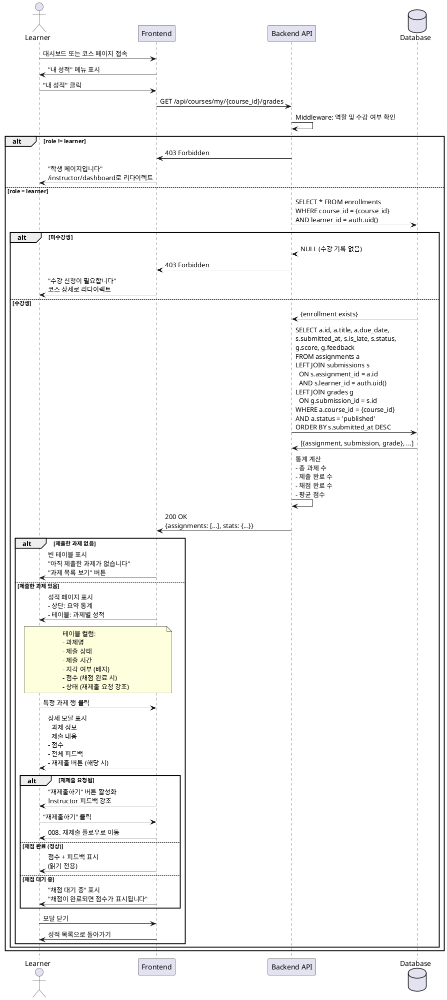

# 009. 성적 조회 (Learner)

## Primary Actor
Learner (학습자)

## Precondition
- 사용자가 Learner 역할로 로그인된 상태
- 온보딩 완료 (`onboarded = true`, `role = 'learner'`)
- 최소 1개 이상의 코스를 수강 신청한 상태
- 최소 1개 이상의 과제를 제출한 상태

## Trigger
Learner가 대시보드 또는 코스 페이지에서 "성적 보기" 또는 "내 성적" 메뉴 클릭

## Main Scenario

1. Learner가 `/courses/my/{course_id}/grades` 페이지 접속
2. Middleware가 역할 및 수강 여부 확인
   - `role = 'learner'`
   - `enrollments` 테이블에 해당 코스 레코드 존재
3. 시스템이 성적 정보 조회
   - 해당 코스의 모든 과제 목록
   - 제출 여부, 제출 시간, 지각 여부
   - 채점 완료된 과제의 점수, 피드백
   - 재제출 요청 여부
4. 성적 페이지 표시 (테이블 형태)
   - 컬럼: 과제명, 제출 상태, 제출 시간, 지각 여부, 점수, 상태
   - 제출 상태: 미제출, 제출됨, 채점완료, 재제출요청
   - 점수: 숫자 또는 "-" (미채점 시)
5. 코스 요약 통계 표시 (상단)
   - 총 과제 수
   - 제출 완료 수
   - 채점 완료 수
   - 평균 점수 (채점된 과제만)
6. Learner가 특정 과제 행 클릭
7. 상세 모달 또는 페이지 표시
   - 과제 정보 (제목, 설명, 마감일)
   - 제출 내용 (텍스트, 파일 다운로드)
   - 점수
   - Instructor 피드백 (전체 내용)
   - 제출 시간, 지각 여부
   - 재제출 요청 여부 및 "재제출하기" 버튼 (해당 시)
8. 모달 닫기 또는 뒤로가기

## Edge Cases

### 1. 권한 없음 (Instructor 접근)
- **상황**: Instructor 역할 사용자가 성적 페이지 접근 시도
- **처리**:
  - Middleware에서 차단
  - HTTP 403 Forbidden 반환
  - `/instructor/dashboard`로 강제 리다이렉트
  - "학생 페이지입니다" 메시지

### 2. 미수강생 접근
- **상황**: 수강 신청하지 않은 코스의 성적 페이지 접근
- **처리**:
  - HTTP 403 Forbidden 반환
  - "수강 신청이 필요합니다" 메시지
  - 코스 상세 페이지로 리다이렉트

### 3. 제출한 과제 없음
- **상황**: 수강 중이지만 아직 과제를 제출하지 않음
- **처리**:
  - 빈 성적 테이블 표시
  - "아직 제출한 과제가 없습니다" 메시지
  - "과제 목록 보기" 버튼 제공

### 4. 채점 대기 중
- **상황**: 과제를 제출했으나 아직 채점되지 않음 (`status = 'submitted'`)
- **처리**:
  - 점수 컬럼: "-" 또는 "채점 대기 중"
  - 상태: "제출됨"
  - 피드백: 없음
  - "채점이 완료되면 점수가 표시됩니다" 안내

### 5. 재제출 요청됨
- **상황**: `status = 'resubmit_requested'`
- **처리**:
  - 점수 컬럼: "-" 또는 "재제출 요청"
  - 상태: "재제출 요청됨" (강조 표시)
  - 피드백: Instructor의 재제출 사유 표시
  - "재제출하기" 버튼 활성화

### 6. 지각 제출
- **상황**: `is_late = true`
- **처리**:
  - "지각" 배지 표시 (경고 색상)
  - 제출 시간에 지각 아이콘 추가
  - 점수에 패널티 표시 (선택, 정책에 따름)

### 7. 미제출 과제
- **상황**: 과제가 게시되었으나 제출하지 않음
- **처리**:
  - 제출 상태: "미제출"
  - 점수: "-"
  - 마감 여부 확인:
    - 마감 전: "제출하기" 버튼 활성화
    - 마감 후: "마감됨" 표시, 버튼 비활성화

### 8. 평균 점수 계산
- **상황**: 일부만 채점된 경우
- **처리**:
  - 채점 완료된 과제만 평균 계산
  - "총 5개 중 3개 채점 완료" 안내
  - 평균: 채점된 3개의 평균 점수

### 9. 점수가 0점
- **상황**: `score = 0`
- **처리**:
  - "0점"으로 명확히 표시 (빈 값과 구분)
  - 피드백 확인 가능
  - 재제출 요청 여부 확인

### 10. 성적 데이터 없음 (DB 오류)
- **상황**: 조회 중 데이터베이스 오류
- **처리**:
  - HTTP 500 Internal Server Error 반환
  - "성적을 불러올 수 없습니다" 메시지
  - "새로고침" 버튼 제공
  - 에러 로그 기록

### 11. 네트워크 오류
- **상황**: 성적 조회 중 네트워크 단절
- **처리**:
  - "네트워크 연결 끊김" 메시지
  - "재시도" 버튼 제공
  - 로딩 스켈레톤 표시 (재시도 전)

### 12. 피드백 없는 채점
- **상황**: `score`는 있으나 `feedback = NULL` 또는 빈 문자열
- **처리**:
  - 점수만 표시
  - 피드백 섹션: "피드백이 없습니다" 또는 숨김

### 13. 긴 피드백
- **상황**: 피드백이 5,000자에 가까움
- **처리**:
  - 테이블에서는 앞 100자만 표시 + "더보기"
  - 상세 모달에서 전체 피드백 표시
  - 스크롤 가능한 영역

### 14. 여러 코스 성적 조회
- **상황**: Learner가 여러 코스 수강 중
- **처리**:
  - `/learner/grades` (전체 성적 페이지)
  - 코스별 탭 또는 섹션으로 구분
  - 각 코스별 평균 점수, 제출률 표시

### 15. 성적 다운로드 (선택, Phase 2)
- **상황**: Learner가 성적을 PDF/CSV로 저장하고 싶음
- **처리**:
  - "성적표 다운로드" 버튼 제공
  - PDF 생성 또는 CSV 내보내기
  - 파일명: `{코스명}_성적표_{날짜}.pdf`

### 16. 성적 정렬/필터
- **상황**: 많은 과제가 있어 찾기 어려움
- **처리**:
  - 정렬: 제출 시간 순, 점수 순, 과제명 순
  - 필터: 채점 완료만, 미채점만, 재제출 요청만

### 17. 실시간 업데이트 (선택, Phase 2)
- **상황**: 페이지 열어둔 상태에서 Instructor가 채점 완료
- **처리**:
  - WebSocket 또는 폴링으로 실시간 업데이트
  - "새 채점 결과가 있습니다" 알림
  - 자동 새로고침 또는 "업데이트" 버튼

## Business Rules

### BR-009-01: Learner 전용
- 성적 조회는 `role = 'learner'`인 사용자만 가능
- 본인이 제출한 과제의 성적만 조회 가능

### BR-009-02: 수강 신청 필수
- 해당 코스를 수강 신청한 Learner만 성적 조회 가능
- `enrollments` 테이블에 레코드 존재 확인
- RLS 정책으로 강제

### BR-009-03: 조회 범위
- 본인이 제출한 과제만 조회 (`learner_id = auth.uid()`)
- 다른 학생의 성적은 조회 불가

### BR-009-04: 표시 정보
**과제별 표시:**
- 과제명
- 제출 상태 (미제출/제출됨/채점완료/재제출요청)
- 제출 시간
- 지각 여부
- 점수 (채점 완료 시)
- 피드백 (채점 완료 시)

**코스 요약 통계:**
- 총 과제 수
- 제출 완료 수 / 총 과제 수
- 채점 완료 수 / 제출 수
- 평균 점수 (채점된 과제만)
- 제출률 (제출 수 / 총 과제 수)

### BR-009-05: 평균 점수 계산
```typescript
function calculateAverage(grades: Grade[]): number | null {
  const gradedScores = grades
    .filter(g => g.score !== null)
    .map(g => g.score);
  
  if (gradedScores.length === 0) return null;
  
  return gradedScores.reduce((a, b) => a + b, 0) / gradedScores.length;
}
```

### BR-009-06: 상태 우선순위
제출물 상태 표시 우선순위:

- resubmit_requested → "재제출 요청됨" (최우선, 강조)
graded → "채점 완료" + 점수 표시
submitted → "제출됨" (채점 대기)
미제출 → "미제출"

### BR-009-07: 점수 표시 규칙

- 채점 완료: 숫자 (0-100)
- 채점 대기: "-" 또는 "대기 중"
- 재제출 요청: "-" 또는 "재제출 요청"
- 미제출: "-" 또는 "미제출"

### BR-009-08: 피드백 표시

- 피드백 있음: 전체 내용 표시 (상세 페이지)
- 피드백 없음: "피드백이 없습니다" 또는 섹션 숨김
- 테이블에서는 앞 100자만 표시 + "더보기"

### BR-009-09: 지각 제출 표시

- `is_late = true `시 "지각" 배지 표시
- 경고 색상 (예: 노란색 또는 주황색)
- 지각 페널티 적용 여부는 코스 정책에 따름 (MVP 제외)

### BR-009-10: 재제출 요청 처리

`status = 'resubmit_requested'` 시:

  - "재제출하기" 버튼 활성화
  - Instructor 피드백 강조 표시
  - 008의 재제출 플로우로 연결


### BR-009-11: 정렬 옵션

- 기본 정렬: 제출 시간 내림차순 (최신 제출이 위)
- 선택 가능: 점수 순, 과제명 순, 마감일 순

### BR-009-12: 필터 옵션 (선택)

- 전체 보기
- 채점 완료만
- 채점 대기 중만
- 재제출 요청만
- 미제출만

### BR-009-13: 성적 통지 (Phase 2)

- 채점 완료 시 Learner에게 이메일/인앱 알림
- "새로운 성적이 등록되었습니다" 메시지

### BR-009-14: 성적 이의 제기 (Phase 2)

- Learner가 점수에 대해 문의 가능
- "이의 제기" 버튼 → Instructor에게 메시지 전송

### BR-009-15: 성적 프라이버시

- 본인 성적만 조회 가능
- 다른 학생 성적 비공개
- 성적 순위 비공개 (MVP)

## Sequence Diagram
