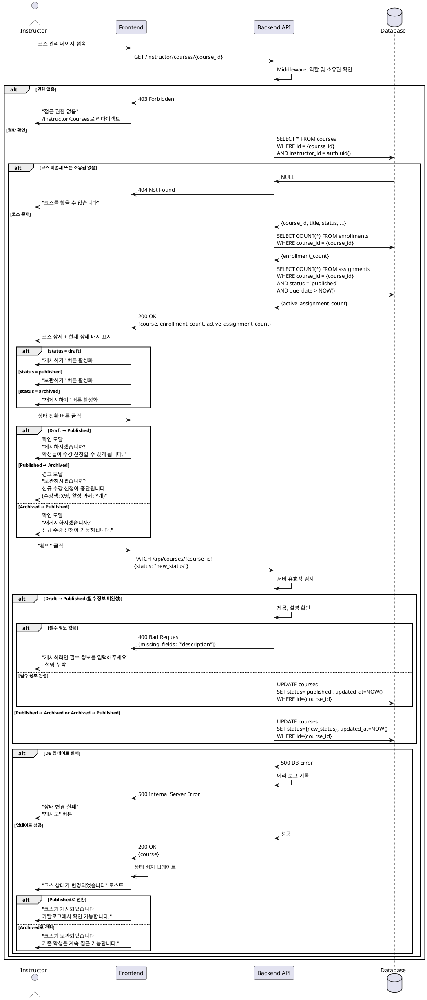

# 010. 코스 상태 관리 (Instructor)

## Primary Actor
Instructor (강사)

## Precondition
- 사용자가 Instructor 역할로 로그인된 상태
- 온보딩 완료 (`onboarded = true`, `role = 'instructor'`)
- 본인이 생성한 코스가 최소 1개 이상 존재

## Trigger
Instructor가 코스 관리 페이지에서 "상태 변경" 드롭다운 또는 버튼 클릭

## Main Scenario

1. Instructor가 `/instructor/courses/{course_id}` 상세 페이지 접속
2. Middleware가 역할 및 코스 소유권 확인
   - `role = 'instructor'`
   - `course.instructor_id = auth.uid()`
3. 현재 코스 상태 표시
   - Draft: "초안" 배지 (회색)
   - Published: "게시됨" 배지 (녹색)
   - Archived: "보관됨" 배지 (노란색)
4. 상태 전환 버튼 또는 드롭다운 표시
   - Draft → "게시하기" 버튼
   - Published → "보관하기" 버튼
   - Archived → "재게시하기" 버튼
5. Instructor가 상태 전환 버튼 클릭
6. 확인 모달 표시
   - Draft → Published: "이 코스를 게시하시겠습니까? 학생들이 수강 신청할 수 있게 됩니다."
   - Published → Archived: "이 코스를 보관하시겠습니까? 신규 수강 신청이 중단되지만 기존 학생은 계속 접근할 수 있습니다."
   - Archived → Published: "이 코스를 다시 게시하시겠습니까? 신규 수강 신청이 가능해집니다."
7. Instructor가 "확인" 클릭
8. 시스템이 상태 전환 가능 여부 검증
   - Draft → Published: 필수 정보 완성 확인 (제목, 설명)
   - Published → Archived: 활성 과제 확인 (경고)
9. 시스템이 `courses` 테이블 업데이트
   - `status = 새로운 상태`
   - `updated_at = NOW()`
10. 성공 후 페이지 새로고침 또는 상태 업데이트
11. "코스 상태가 변경되었습니다" 토스트 메시지
12. 새 상태 배지 표시

## Edge Cases

### 1. 권한 없음 (Learner 접근)
- **상황**: Learner 역할 사용자가 상태 변경 시도
- **처리**:
  - 상태 변경 버튼 숨김 (UI 레벨)
  - API 요청 시 HTTP 403 Forbidden 반환
  - "접근 권한이 없습니다" 메시지

### 2. 코스 소유권 없음
- **상황**: 다른 Instructor의 코스 상태 변경 시도
- **처리**:
  - HTTP 403 Forbidden 반환
  - "본인의 코스만 관리할 수 있습니다" 메시지
  - `/instructor/courses`로 리다이렉트

### 3. 코스 미존재
- **상황**: 삭제되었거나 존재하지 않는 코스 ID
- **처리**:
  - HTTP 404 Not Found 반환
  - "코스를 찾을 수 없습니다" 메시지
  - `/instructor/courses`로 리다이렉트

### 4. Draft → Published (필수 정보 미완성)
- **상황**: 제목 또는 설명이 비어있는 상태에서 게시 시도
- **처리**:
  - HTTP 400 Bad Request 반환
  - "게시하려면 필수 정보를 모두 입력해주세요" 메시지
  - 필수 항목 나열: "제목, 설명"
  - "코스 편집" 버튼 제공

### 5. Draft → Published (과제 없음)
- **상황**: 과제가 하나도 없는 코스 게시 시도
- **처리**:
  - 경고 모달: "과제가 없는 코스입니다. 게시하시겠습니까?"
  - 확인 시 게시 허용 (정책에 따름)
  - 권장: 최소 1개 과제 생성 안내

### 6. Published → Archived (활성 과제 있음)
- **상황**: 마감되지 않은 과제가 있는 코스 보관 시도
- **처리**:
  - 경고 모달: "마감되지 않은 과제가 X개 있습니다. 계속하시겠습니까?"
  - 활성 과제 목록 표시
  - 확인 시 보관 허용
  - 주의: 기존 학생은 계속 과제 제출 가능

### 7. Published → Archived (수강생 있음)
- **상황**: 수강생이 있는 코스 보관 시도
- **처리**:
  - 경고 모달: "현재 X명이 수강 중입니다. 보관하시겠습니까?"
  - "기존 학생은 계속 접근 가능하지만 신규 수강 신청은 중단됩니다" 안내
  - 확인 시 보관 허용

### 8. Archived → Published (재게시)
- **상황**: 보관된 코스를 다시 게시
- **처리**:
  - 확인 모달: "이 코스를 다시 게시하시겠습니까?"
  - "신규 수강 신청이 다시 가능해집니다" 안내
  - 확인 시 Published로 전환

### 9. 동일 상태로 전환 시도
- **상황**: 이미 Published인 코스를 Published로 변경 시도
- **처리**:
  - 클라이언트: 같은 상태 버튼 비활성화
  - API 요청 시 HTTP 400 Bad Request 반환
  - "이미 해당 상태입니다" 메시지

### 10. 데이터베이스 업데이트 실패
- **상황**: `courses` 테이블 UPDATE 실패
- **처리**:
  - HTTP 500 Internal Server Error 반환
  - "상태 변경에 실패했습니다. 잠시 후 다시 시도해주세요" 메시지
  - 에러 로그 기록
  - "재시도" 버튼 제공

### 11. 네트워크 단절
- **상황**: 상태 변경 요청 중 네트워크 연결 끊김
- **처리**:
  - "네트워크 연결이 끊어졌습니다" 메시지
  - "재시도" 버튼 제공
  - 페이지 새로고침 후 현재 상태 확인

### 12. 동시성 문제
- **상황**: 여러 탭/창에서 동시에 상태 변경
- **처리**:
  - 마지막 변경이 반영됨 (Last Write Wins)
  - 또는 낙관적 잠금 사용
  - "다른 곳에서 수정되었습니다" 경고

### 13. 빠른 연속 상태 변경
- **상황**: Published → Archived → Published 빠르게 전환
- **처리**:
  - 정상 동작 (각 전환마다 확인 모달)
  - 레이트 리밋 없음 (Instructor 신뢰)
  - 변경 이력 기록 (선택, Phase 2)

### 14. Draft 삭제 (선택)
- **상황**: Draft 상태 코스 삭제 시도
- **처리**:
  - "삭제하기" 버튼 제공 (Draft만)
  - 확인 모달: "정말 삭제하시겠습니까? 이 작업은 되돌릴 수 없습니다."
  - Published/Archived는 삭제 불가 (데이터 보호)

### 15. 카탈로그 노출 변화
- **상황**: Draft → Published 전환 시
- **처리**:
  - 즉시 카탈로그에 노출
  - Learner가 검색/발견 가능
  - 캐시 무효화 (있는 경우)

### 16. 수강생 알림 (선택, Phase 2)
- **상황**: Archived → Published 재게시
- **처리**:
  - 기존 수강생에게 "코스가 재개되었습니다" 알림
  - 이메일 또는 인앱 알림

## Business Rules

### BR-010-01: Instructor 전용
- 코스 상태 관리는 `role = 'instructor'`인 사용자만 가능
- 본인이 생성한 코스만 관리 가능
- `course.instructor_id = auth.uid()` 조건

### BR-010-02: 상태 전환 규칙

draft ⇄ published ⇄ archived
허용되는 전환:

- draft → published (게시)
- published → draft (게시 취소, 선택적)
- published → archived (보관)
- archived → published (재게시)

허용되지 않는 전환:

- draft → archived (직접 전환 불가, published 거쳐야 함)
- archived → draft (불가)

### BR-010-03: Draft 상태
- 작성 중인 코스
- Instructor 본인만 조회 가능
- 카탈로그에 노출되지 않음
- 수강 신청 불가
- 과제 작성 가능

### BR-010-04: Published 상태
- 게시된 코스
- 모든 사용자가 조회 가능
- 카탈로그에 노출됨
- 수강 신청 가능
- 과제 제출/채점 가능

### BR-010-05: Archived 상태
- 보관된 코스
- 카탈로그에 노출되지 않음 (또는 별도 섹션)
- **신규 수강 신청 불가**
- **기존 수강생은 계속 접근 가능**
  - 과제 제출 가능
  - 성적 조회 가능
  - 학습 자료 접근 가능
- Instructor는 계속 관리 가능 (채점 등)

### BR-010-06: Published 전환 조건
Draft → Published 전환 시 필수 조건:
- 제목 입력됨 (1-200자)
- 설명 입력됨 (10-5000자)
- 썸네일: 선택 (없으면 기본 이미지)
- 과제: 선택 (없어도 게시 가능, 경고만)

### BR-010-07: Archived 전환 영향
Published → Archived 전환 시:
- 신규 `enrollments` 생성 불가
- 기존 `enrollments` 유지
- 기존 학생은 코스 페이지 접근 가능
- 과제 제출/채점 계속 가능
- 카탈로그에서 제거

### BR-010-08: 재게시 조건
Archived → Published 전환 시:
- 별도 조건 없음 (언제든 가능)
- 신규 수강 신청 재개
- 카탈로그에 다시 노출
- 기존 학생 데이터 유지

### BR-010-09: 상태별 접근 제어
**Draft:**
- Instructor 본인: 모든 권한
- 다른 Instructor: 접근 불가
- Learner: 접근 불가

**Published:**
- Instructor 본인: 모든 권한
- 다른 Instructor: 조회만 (수강 불가)
- Learner: 조회 + 수강 신청 가능

**Archived:**
- Instructor 본인: 모든 권한
- 다른 Instructor: 조회만
- Learner (기존 수강생): 조회 + 과제 제출 가능
- Learner (미수강생): 수강 신청 불가

### BR-010-10: 자동 타임스탬프
- `updated_at`: 상태 변경 시 자동 갱신
- `published_at`: Published로 전환 시 기록 (선택)
- `archived_at`: Archived로 전환 시 기록 (선택)

### BR-010-11: 삭제 정책 (선택)
- Draft: 삭제 가능
- Published: 삭제 불가 (Archived로 전환 권장)
- Archived: 삭제 불가 (영구 보관)
- 소프트 삭제 사용 (Phase 2)

### BR-010-12: 통계 영향
- Published 코스만 카탈로그 통계에 포함
- Archived 코스는 "보관된 코스" 별도 집계
- Draft 코스는 통계에서 제외

### BR-010-13: 검색 노출
- Draft: 검색 결과에서 제외
- Published: 검색 가능
- Archived: 검색에서 제외 (또는 필터 옵션)

### BR-010-14: 상태 변경 이력 (Phase 2)
- 상태 변경 시각, 변경자 기록
- `course_status_history` 테이블
- Instructor가 변경 이력 조회 가능

### BR-010-15: 알림 (Phase 2)
- Published → Archived: 수강생에게 알림
- Archived → Published: 수강생에게 재개 알림

---

## Sequence Diagram

